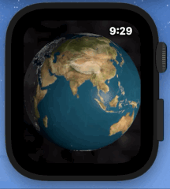
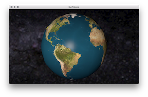
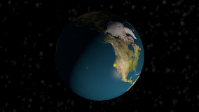

# SwiftGlobe

An interactive 3D globe in SceneKit for iOS, watchOS, tvOS, and MacOS X.  Built in Swift 5 with XCode 11.4.

Requires iOS 11, tvOS 11, macOS 10.13 (High Sierra)

## Features

- Targets for macOS, iOS, & tvOS
- Visual quality
	- mountains cast shadows (implemented with a normal map)
	- water is reflecty, land is matte (implemented with metalness & roughness maps)
	- detailed milkyway in the background
	- use high-quality earth texture on macOS (looks great on retina displays, even when zoomed in)
- Accurate modeling
	- earth's axis varies by the current day of the year (north pole gets more sun in the summer, less in the winter)
	- tilt the milkyway relative to the solar system's orbital plane
- Interactive
	- support pan & zoom gestures
	- support tvOS remote, too (pan & zoom)
	- glowing dots for markers 

## TODOs

In no particular order:
- Add AR target (for iPhone/iPad)
    - [x] babystep: Add target, with automatic globe placement.  (done but glitchy)
    - [ ] Add placement tracking & lock feedback
- Add Apple Watch support, using SwiftUI
    - [x] use small textures
    - [x] handle pan & crown-zoom events (nb: no pinch gesture on the watch!)
    - NB: integrating the globe into your own app will take a little work: e.g. the gesture & crown behavior must be handled in your InterfaceController
- [x] show city lights on darkside (shader modifier)
- [x] align globe up&down along the natural axis (or optionally along the day/night terminator instead)
- [x] Use current day-of-year to compute accurate seasonal tilt
- [ ] add point-to-point connection visualization
- [ ] cubemap for earth texture (fix slight smearing at poles)
- [ ] fix normal map 'dimple' at the north pole
- [ ] add an orbiting moon
- [ ] support scrollwheel zoom on Mac
- [ ] Support new Apple TV 'Siri Remote' (introduced Oct 2015)
    - with touchpad & motion (see https://developer.apple.com/videos/play/techtalks-apple-tv/4/ )
    - or plain swipe gestures (UIPanGestureRecognizer)
- [ ] Support new Apple TV game controllers (new in tvOS 13.0, Sept 2019) 
    - Sony DualShock

## License

This project is licensed under the MIT License - see the [LICENSE.md](LICENSE.md) file for details

## Acknowledgments

* WWDC 2013 session 'What's new in SceneKit' (session, video, & demo source all very helpful)
* WWDC 2016 session 'Advances in SceneKit Rendering' (especially physically based materials)
* InfiniteRed's [interactive seven-foot globe](http://infinitered.com/2015/02/10/a-seven-foot-globe-running-on-os-x-and-an-ipad-app-created-using-rubymotion-and-scenekit/) (built with SceneKit & physics) 
* Milkyway Skymap
    * source image from European Southern Observatory (https://www.eso.org/public/usa/images/eso0932a/)
    * converted to cubemap (from equirectangular panorama) with a python script provided by Benjamin Dobell (http://stackoverflow.com/a/36976448/235229)
* Earth texture by Jim Hastings-Trew at [planetpixelemporium.com](http://planetpixelemporium.com/earth.html)
